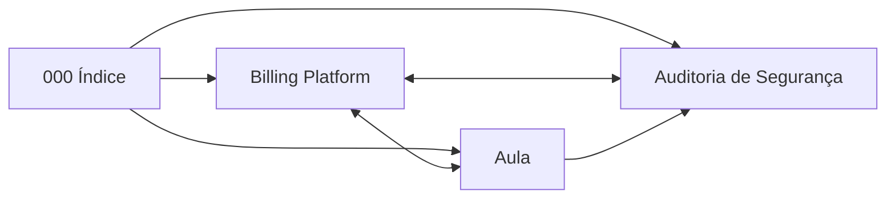

# Billing Platform — Índice

> [!info] Este é o ponto de entrada do vault
> Três notas, cada uma com um propósito diferente. Comece pela que corresponde
> ao que você quer agora.

## As notas

| Nota | Quando abrir |
|---|---|
| [[Billing Platform]] | **Entender o sistema.** O que é, as decisões que o definem, modelo de dados, diagramas |
| [[Aula — Construindo uma Plataforma de Cobrança]] | **Aprender a construir.** O raciocínio passo a passo: problema → solução ingênua → por que quebra → o certo |
| [[Auditoria de Segurança]] | **Estudar segurança.** Os 12 ataques, os 2 achados reais, o que não foi coberto |

## A diferença entre a nota do projeto e a aula

Elas cobrem o mesmo sistema, mas respondem perguntas diferentes:

- **[[Billing Platform]]** dá as **conclusões** — *"o preço é copiado do plano
  para a assinatura porque reajuste não pode reprecificar contrato vivo."*
- **[[Aula — Construindo uma Plataforma de Cobrança]]** dá a **pergunta** —
  *"esse valor descreve o mundo agora ou registra um acordo do passado? Se
  registra acordo, ele se copia: vale para preço, endereço de entrega, alíquota
  de imposto."*

A primeira serve para consultar quando você esquecer por que fez assim. A
segunda serve para acertar no próximo projeto, que não vai ser sobre cobrança.

## Fora do vault

Documentação de referência, no repositório:

- `README.md` — como rodar e testar
- `CLAUDE.md` — as decisões que parecem erro e não são
- `docs/ARQUITETURA.md` — decisões com trade-offs, seção por seção

🔗 https://github.com/CaioCodes1/billing-platform

## Assuntos para notas futuras

Links que ainda não têm destino — cada um é uma nota que vale escrever:

- [[Idempotência]] — chave única de negócio como propriedade do dado
- [[Append-only ledger]] — por que dinheiro nunca se corrige, só se compensa
- [[Armadilhas do @Transactional]] — self-invocation, entidade destacada, REQUIRES_NEW
- [[Testcontainers]] — por que banco real e não H2
