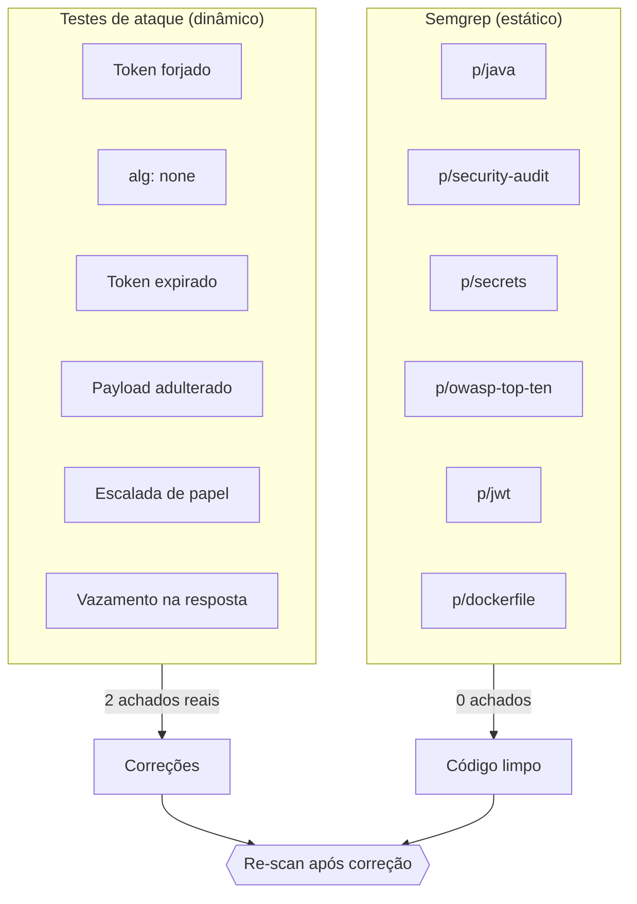
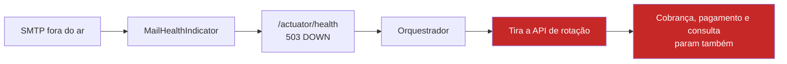

# Auditoria de Segurança — [[Billing Platform]]

> [!abstract] O que foi feito
> Depois das 10 fases prontas, a segurança foi atacada por dois lados
> complementares: **testes que tentam quebrar a API** e **análise estática** do
> código. Os dois acharam coisa — mas não o que eu esperava.



---

## Por que teste de ataque e não só "teste de segurança"

A diferença é de **postura**. O teste normal pergunta *"o caminho feliz
funciona?"*. O teste de ataque pergunta *"o que acontece se eu mentir?"*.

Um exemplo do próprio projeto. O teste de login que já existia fazia:

```java
// Isso prova que o login funciona. Não prova que ele é seguro.
login("admin@teste.local", "senha-certa") → 200 + token
```

O teste de ataque faz:

```java
// Isso prova que a assinatura do token é verificada de verdade.
String forjado = assinar("chave-do-atacante-...", claimsDeAdmin());
GET /api/v1/customers com esse token → tem que ser 401
```

São 12 casos em `SegurancaHardeningIT`, cada um correspondendo a um ataque real:

| Ataque | O que ele explora | Teste |
|---|---|---|
| Token com outra chave | Servidor que decodifica sem verificar assinatura | `tokenComChaveErrada` |
| `alg: none` | Biblioteca que aceita o algoritmo declarado pelo próprio token | `tokenSemAssinatura` |
| Token expirado | Servidor que checa assinatura mas esquece o `exp` | `tokenExpirado` |
| Payload trocado | Quem acha que JWT é só base64 e o corpo pode ser reescrito | `payloadAdulterado` |
| Header malformado | Parser que estoura em vez de recusar | `headerMalformado` |
| SUPPORT → ADMIN | Autorização só no controller, contornável por outra rota | `suportNaoEscalaParaAdmin` |
| Basic Auth | Caminho de autenticação paralelo esquecido ligado | `basicAuthNaoEhAceito` |
| Bean de usuário padrão | Auto-configuração criando usuário em memória | `semUsuarioPadraoEmMemoria` |
| Actuator aberto | Métricas expondo interno sem autenticação | `actuatorProtegido` |
| Hash na resposta | Serialização vazando `passwordHash` | `nuncaVazaSenha` |
| Stacktrace no erro | Mensagem de erro revelando estrutura interna | `erroNaoVazaInterno` |
| Enumeração de usuário | Resposta diferente para e-mail que existe | `loginNaoEnumeraUsuarios` |

> [!tip] O `alg: none` merece explicação
> É o ataque clássico contra JWT. O token declara **no próprio header** qual
> algoritmo o servidor deve usar para validar. Uma biblioteca ingênua lê
> `{"alg":"none"}`, conclui "esse token não tem assinatura para conferir" e
> aceita o payload como verdadeiro — incluindo `"roles":["ADMIN"]`. A defesa é
> o servidor **impor** o algoritmo, não perguntar ao token. O
> `NimbusJwtDecoder.withSecretKey(...).macAlgorithm(HS256)` faz isso.

---

## Achado 1 — `httpBasic` ligado numa API que só fala JWT

O `SecurityConfig` tinha isto:

```java
.oauth2ResourceServer(oauth -> oauth.jwt(...))
.httpBasic(Customizer.withDefaults())   // ← por que isso está aqui?
```

**A suspeita inicial era grave.** Quando não existe `UserDetailsService`,
`AuthenticationProvider` nem `AuthenticationManager`, o Spring Boot cria
sozinho um usuário `user` em memória com senha aleatória (aquela que aparece no
log do boot). Com `httpBasic` ligado, esse usuário seria uma **segunda porta de
autenticação**, paralela ao JWT — e autenticado é autenticado: passaria por
qualquer `isAuthenticated()`.

**A suspeita não se confirmou.** E o porquê é a parte que vale guardar:

> [!warning] A proteção vinha de efeito colateral, não de decisão
> A auto-configuração do usuário padrão **recua quando existe um `JwtDecoder`** —
> e existe, porque o `oauth2ResourceServer` precisa dele. Ou seja: a API estava
> protegida por um detalhe de implementação de *outra* parte do framework.
>
> Segurança que funciona por acidente continua funcionando só enquanto o
> acidente durar.

Removi mesmo assim. Três razões:

1. O filtro `BasicAuthenticationFilter` roda em toda requisição e nunca
   autentica ninguém — custo sem benefício.
2. A API responde `WWW-Authenticate: Basic` a quem sonda, **anunciando** um
   método de login que não existe.
3. No dia em que alguém registrar um `UserDetailsService` por qualquer outro
   motivo, a porta abre **calada** — sem erro, sem log, sem teste falhando.

### A lição de método: meu primeiro teste era fraco

O teste que escrevi para isso, na primeira versão:

```java
// FRACO — passa nos dois mundos
String cred = base64("user:qualquer");
GET /api/v1/customers com "Authorization: Basic " + cred
    → espera 401
```

O problema: **credencial errada devolve 401 com ou sem Basic ligado.** O teste
passaria com a vulnerabilidade presente. Ele não testava nada.

O que realmente distingue os dois mundos é o **desafio** na resposta: um filtro
Basic ativo responde `WWW-Authenticate: Basic realm="..."`. A versão corrigida:

```java
String desafio = mockMvc.perform(...)
        .andExpect(status().isUnauthorized())
        .andReturn().getResponse().getHeader("WWW-Authenticate");

assertThat(desafio).doesNotContainIgnoringCase("Basic");
```

E um segundo teste trava a **causa raiz**, não o sintoma:

```java
assertThat(contexto.getBeanNamesForType(UserDetailsService.class)).isEmpty();
assertThat(contexto.getBeanNamesForType(AuthenticationProvider.class)).isEmpty();
```

> [!danger] Teste de segurança que passa pelo motivo errado é pior que teste nenhum
> Ele produz confiança sem produzir garantia. Sempre que escrever um teste de
> segurança, pergunte: **"esse teste falharia se a vulnerabilidade existisse?"**
> Se a resposta não for um sim óbvio, o teste está errado.

---

## Achado 2 — o e-mail derrubava o health check

`/actuator/health` devolvia **503** nos testes de integração. Não era falha de
segurança — foi o teste de segurança que esbarrou nela.

A causa: o `spring-boot-starter-mail` registra um `MailHealthIndicator`
automaticamente, e ele **abre conexão SMTP a cada consulta ao health**. Com o
Mailpit fora do ar (situação normal num teste de integração), o health inteiro
vira DOWN.



Em produção isso é bem pior do que um 503 num teste. O Kubernetes lê o health
para decidir se manda tráfego para o pod. Servidor de e-mail instável →
API **inteira** fora de rotação → cliente não consegue nem consultar a própria
fatura, porque um canal de **notificação** está indisponível.

E aqui o envio nem é síncrono: passa pelo [[Billing Platform|outbox]], que já
reprocessa sozinho com backoff. SMTP fora significa **atraso de notificação**,
não indisponibilidade do serviço.

```yaml
management:
  health:
    mail:
      enabled: false
```

> [!important] A regra que fica
> Um health check responde **"consigo atender requisições?"** — não "está tudo
> perfeito?". Dependência que não bloqueia o fluxo principal **não entra no
> health**. Se entrar, você transformou uma degradação parcial numa queda total.

---

## Semgrep: análise estática

**Resultado: 153 regras, 105 arquivos, 0 achados, 0 erros de parse.**

O scan rodou **depois** das correções, então serve como validação de que os
consertos não introduziram nada.

### Rodando sem instalar Python

O `python3` do PATH nesta máquina é o *stub* da Microsoft Store, não um Python
real — e instalar Python de verdade custaria ~650 MB num SSD apertado. A saída
é rodar por container:

```bash
docker run --rm \
  --mount "type=bind,source=E:\projetos\billing-platform,target=/src,readonly" \
  semgrep/semgrep semgrep --metrics=off \
    --config p/java --config p/security-audit --config p/secrets \
    --config p/owasp-top-ten --config p/jwt --config p/dockerfile /src
```

### Três armadilhas que custaram tempo

> [!bug] `--config auto` recusa rodar com `--metrics=off`
> A recomendação padrão é `semgrep --config auto .`. O `auto` **manda dados do
> projeto para o semgrep.dev** para escolher as regras — por isso ele exige
> telemetria ligada e aborta com *"Cannot create auto config when metrics are
> off"*. Packs explícitos cobrem o mesmo terreno sem enviar nada.

> [!bug] `-v caminho:/dest:ro` não funciona com letra de unidade
> O Docker separa o `-v` por `:` e vê **quatro** campos em
> `E:\projetos\x:/src:ro`. Use `--mount type=bind,source=...,target=...,readonly`.

> [!bug] O `DOCKER_HOST` do Testcontainers quebra o bind mount
> Esta foi a mais traiçoeira. A variável
> `DOCKER_HOST=npipe:////./pipe/docker_engine_linux` — necessária para o
> Testcontainers funcionar com o Engine 29 — **contorna o proxy do Docker
> Desktop**. E é justamente o proxy quem traduz `E:\` para o caminho Linux
> dentro da VM. Sem ele: *"mount path must be absolute"*.
>
> A saída é limpar a variável só naquele comando: `DOCKER_HOST= docker run ...`
> (no Git Bash, com `export MSYS_NO_PATHCONV=1` antes, senão ele mastiga o
> caminho antes do Docker ver).

### O que o Semgrep não olhou

O `.semgrepignore` padrão **pula diretórios de teste**. Os 105 arquivos
escaneados são os 93 de `src/main/java` mais SQL, YAML e o `pom.xml` — código de
produção coberto por inteiro.

---

## O que a auditoria NÃO cobriu

> [!missing] Lacunas conhecidas — nenhuma é bug, mas duas são trabalho futuro
> **1. Não há proteção contra força bruta no login.** Nenhum rate limit, nenhum
> bloqueio por tentativas falhas. Hoje dá para bombardear `POST /auth/login`
> sem limite. **É a única lacuna de segurança real que sobrou.**
>
> **2. Não há scan de CVE nas dependências.** O Semgrep analisa o *seu* código,
> não as bibliotecas de terceiros. Falta um OWASP Dependency-Check ou Trivy no
> build para pegar vulnerabilidade conhecida em Spring, Nimbus, driver do
> Postgres.
>
> **3. Não houve DAST** — nenhum ataque contra a aplicação rodando de verdade,
> só via `MockMvc`.

E uma ausência que **é** decisão, não lacuna: **não há CORS configurado**. Sem
configuração, o navegador já bloqueia cross-origin por padrão, e esta API não
tem front-end de browser. Configurar CORS aqui só abriria superfície.

---

## Resumo

| | |
|---|---|
| Testes de ataque | 12/12 verdes (`SegurancaHardeningIT`) |
| Testes de fluxo de auth | 12/12 verdes (`SegurancaIT`) |
| Semgrep | 153 regras · 105 arquivos · **0 achados** |
| Achados reais | 2 — ambos corrigidos |
| Suíte completa | **187 testes**, cobertura 89,2% |
| Commit | `19fbd57` |

### As três frases que valem para qualquer projeto

1. **Segurança que funciona por efeito colateral não é segurança** — é sorte com
   prazo de validade.
2. **Um teste de segurança precisa falhar se a vulnerabilidade existir.** Se
   passaria nos dois mundos, não testa nada.
3. **Health check responde "consigo atender?", não "está tudo bem?"** — senão
   uma degradação parcial vira queda total.

---

**Ver também:** [[Billing Platform]] · seção 6.1 de `docs/ARQUITETURA.md`
