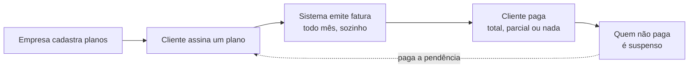

# Aula — Construindo uma Plataforma de Cobrança

> [!abstract] O que esta nota é
> Não é a documentação do projeto — essa é [[Billing Platform]] e o
> `docs/ARQUITETURA.md`. Esta aqui é o **passo a passo do raciocínio**: em que
> ordem construir, que pergunta fazer em cada etapa, qual é a solução ingênua,
> por que ela quebra, e o que colocar no lugar.
>
> Se você só ler as conclusões, aprende o projeto. Se ler as **perguntas**,
> aprende a resolver o próximo.

---

## Parte 0 — Entender o problema antes de abrir a IDE

Uma plataforma de cobrança recorrente faz cinco coisas:



Parece um CRUD com um `@Scheduled`. **Não é.** O que separa os dois são quatro
perguntas que um CRUD nunca precisa responder:

1. Se o job rodar duas vezes, o cliente é cobrado duas vezes?
2. Se o plano aumentar de preço, quem já assinou paga o preço novo?
3. Se um pagamento for estornado, como você desfaz sem apagar histórico?
4. Se o cliente assinou dia 31, quando vence a fatura de fevereiro?

Todo o resto da aula é sobre essas quatro.

> [!tip] Regra que vale para qualquer domínio
> Antes de modelar, escreva as perguntas que o sistema **não pode errar**. Elas
> viram constraints no banco, não `if` no código. Um `if` é uma opinião; uma
> constraint é uma lei.

---

## Parte 1 — A ordem de construção

Construí em 10 fases, e a ordem não foi arbitrária. A regra é: **cada fase tem
que ser testável sozinha, e nenhuma fase pode depender de algo que ainda não
existe.**

| Fase | O que entra | Por que nesta posição |
|---|---|---|
| 1 | Fundação, schema completo, erro global | O schema inteiro de uma vez: mudar tabela depois custa migration nova |
| 2-3 | `Customer`, `Plan` | Não dependem de nada. São o CRUD que valida a arquitetura |
| 4 | `Subscription` | Precisa de cliente e plano existindo |
| 5 | `Invoice` | Precisa de assinatura para faturar |
| 6 | `Payment` | Precisa de fatura para pagar |
| 7 | Segurança | Só depois que existe o que proteger |
| 8 | Scheduler | Automatiza o que já funciona manualmente |
| 9 | Dashboard | Lê o que as fases anteriores escreveram |
| 10 | Outbox + e-mail | O último porque é o único opcional |

> [!important] Por que o schema inteiro na fase 1
> A tentação é criar tabela conforme precisa. O problema: **migration já aplicada
> não se edita.** Se na fase 6 você descobre que `invoices` precisava de uma
> coluna, é uma `V6__` nova — e o histórico de migrations vira o diário das suas
> dúvidas em vez do desenho do sistema.
>
> Modelar tudo antes força você a responder as quatro perguntas da Parte 0
> **antes** de escrever código que depende delas.

### As camadas, e a regra que as mantém honestas

```
controller  →  service  →  repository
    │             │            │
  HTTP        regra de       SQL
              negócio
```

A regra que faz isso funcionar não é a divisão em pastas — é esta:

> **O service não importa nada de `org.springframework.web`.**

Se o service não conhece `HttpServletRequest`, `ResponseEntity` nem código de
status, ele fica utilizável pelo job noturno, por um consumidor de fila, por um
teste. No dia em que a regra "só ADMIN cria plano" precisar valer para uma rota
nova, ela já vale — porque mora no service:

```java
@PreAuthorize("hasRole('ADMIN')")     // no SERVICE, não no controller
public PlanResponse criar(CreatePlanRequest request) { ... }
```

A tradução de exceção para HTTP acontece num único lugar, o
`GlobalExceptionHandler`, em formato **RFC 7807** (`ProblemDetail`) — o padrão
de corpo de erro do HTTP, para não inventar um formato próprio.

---

## Parte 2 — Modelagem: as três perguntas que revelam o schema

### Pergunta 1: "esse valor descreve o mundo agora, ou registra um acordo do passado?"

Esta é a pergunta mais valiosa da aula inteira.

O cliente assina o plano Premium por R$ 99. Seis meses depois a empresa reajusta
o Premium para R$ 129. **O que o cliente paga no mês seguinte?**

A resposta ingênua é ler o preço do plano na hora de faturar:

```java
// ERRADO — reprecifica a base inteira retroativamente
BigDecimal valor = assinatura.getPlan().getMonthlyPrice();
```

Um `UPDATE plans SET monthly_price = 129` acabou de aumentar a fatura de **todo
mundo** que já tinha contratado por 99. Você não reajustou o catálogo — você
reescreveu contratos.

A correção é uma linha:

```java
this.unitPrice = plan.getMonthlyPrice();   // cópia no momento da contratação
```

> [!tip] A pergunta que generaliza
> **Descreve o agora, ou registra um acordo?**
> - Preço de catálogo → descreve o agora → *referência*
> - Preço contratado → registra um acordo → **cópia**
>
> Vale igual para endereço de entrega num pedido, nome do produto numa nota
> fiscal, alíquota de imposto numa venda. Se o dado precisa sobreviver a uma
> mudança na origem, ele se copia.

No projeto são **duas cópias em série**: plano → assinatura → cobrança. A
contrapartida é que reajustar contrato vivo vira uma ação explícita
(`POST /subscriptions/{id}/migrate-price`), e não um efeito colateral.

### Pergunta 2: "essa regra pode ser violada por duas requisições simultâneas?"

A regra do sistema: **um cliente só pode ter uma assinatura ativa.**

A implementação ingênua:

```java
if (repository.existsAtivaPara(clienteId)) {
    throw new ConflitoException("cliente já tem assinatura");
}
repository.save(novaAssinatura);
```

Parece certo. Sob concorrência, não é:

```
Requisição A: já existe? → não
Requisição B: já existe? → não      ← as duas leram antes de qualquer escrita
A: INSERT ✓
B: INSERT ✓                          ← duas assinaturas ativas
```

> [!danger] `if` não é trava
> Um `if` lê um estado que **já pode ter mudado** no instante em que você age
> sobre ele. Entre o `SELECT` e o `INSERT` existe uma janela, e concorrência é
> exatamente a arte de cair nessa janela.

A trava real vai no banco, e no Postgres ela é elegante — um **índice único
parcial**:

```sql
CREATE UNIQUE INDEX uq_subscriptions_active_slot ON subscriptions (customer_id)
    WHERE status IN ('PENDING', 'ACTIVE', 'SUSPENDED');
```

Leia em voz alta: *"não pode haver dois registros com o mesmo `customer_id`
**entre os que estão nestes estados**"*. Cancelada não conta — o que
implementa "só o cancelamento libera a vaga" sem uma linha de código.

E o `if`? **Continua no código** — mas mudou de função:

| | Papel |
|---|---|
| `if` no service | dá a **mensagem boa**: "este cliente já tem uma assinatura ativa" |
| constraint no banco | dá a **garantia**: sob concorrência, uma das duas falha |

O primeiro é útil, o segundo é correto. Você quer os dois. O service captura a
violação de constraint e a traduz para a mesma mensagem amigável.

### Pergunta 3: "esse dado pode ser corrigido, ou só compensado?"

Um pagamento foi registrado errado. O reflexo é `UPDATE payments SET amount = ...`
ou `DELETE`.

Em dinheiro, isso é falsificação de histórico. O mundo real não apaga
lançamento — ele lança o **oposto**.

```sql
-- trigger que recusa qualquer UPDATE ou DELETE em payments
CREATE TRIGGER trg_payments_append_only
    BEFORE UPDATE OR DELETE ON payments
    FOR EACH ROW EXECUTE FUNCTION fn_bloqueia_alteracao();
```

Para desfazer, lança-se `type = 'REFUND'` com valor negativo. E o status da
fatura **nunca é atribuído** — é derivado da soma do razão:

```java
// Nunca: invoice.setStatus(PAID) olhando um pagamento isolado.
BigDecimal pago = pagamentos.stream()
        .map(Payment::getSignedAmount)      // REFUND entra negativo
        .reduce(BigDecimal.ZERO, BigDecimal::add);
```

De graça, sem um `if` por cenário, você ganha: pagamento parcial, pagamento a
maior (crédito visível em vez de perdido), estorno, chargeback, e auditoria
financeira completa **sem tabela de auditoria**.

> [!important] O padrão se chama *append-only ledger*
> É como bancos, contabilidade e blockchain funcionam. Sempre que o histórico
> importa mais que o estado atual, guarde os **eventos** e derive o estado.

---

## Parte 3 — O ciclo de cobrança

### A correção mais importante do projeto

O enunciado original dizia: *"nova cobrança gerada após o pagamento da anterior"*.

Implemente isso literalmente e observe o que acontece com quem **não** paga:

```
Janeiro:  fatura emitida → não paga
Fevereiro: ...nada. A próxima depende do pagamento da anterior.
Março:     ...nada.
```

O inadimplente fica devendo **um mês para sempre**. O "total pendente" do
dashboard passa a ser estruturalmente errado, e a régua de inadimplência não tem
insumo — não há o que cobrar.

A cobrança tem que nascer do **ciclo**, não do pagamento:

```
todo dia, o job pergunta: quem tem renovação vencendo hoje?
    → emite fatura, pago ou não
```

E o freio contra a bola de neve não é parar de faturar — é **parar o serviço**:

- assinatura `SUSPENDED` **não gera** cobrança nova (dívida para quando o serviço para)
- quitada a pendência, volta a `ACTIVE` e o ciclo retoma

> [!tip] A lição que transfere
> Quando um requisito acopla dois eventos ("B acontece depois de A"), pergunte:
> **e se A nunca acontecer?** Se a resposta for "o sistema trava num estado
> inconsistente", o acoplamento está errado.

### O bug do dia 31

O cliente assina em **31/01**. Quando vence a próxima?

```java
LocalDate proxima = periodoAtual.plusMonths(1);
```

Acompanhe:

```
31/01 .plusMonths(1) → 28/02   ✓ correto, o Java limita sozinho
28/02 .plusMonths(1) → 28/03   ✗ e aqui o cliente virou "do dia 28"
28/03 .plusMonths(1) → 28/04      para sempre
```

> [!bug] O erro não é o `plusMonths`
> O `plusMonths` está **certo** — 31/01 + 1 mês tem que ser 28/02, fevereiro não
> tem dia 31. O erro é usar a data **já limitada** como base do cálculo seguinte.
> A limitação de fevereiro vira permanente.

A correção é guardar o **dia contratado** separado da data corrente e recalcular
sempre a partir dele:

```java
public static LocalDate dataNoMes(YearMonth mes, int diaDesejado) {
    return mes.atDay(Math.min(diaDesejado, mes.lengthOfMonth()));
}

public static LocalDate fimDoPeriodo(LocalDate inicio, int diaDeCobranca) {
    YearMonth proximoMes = YearMonth.from(inicio).plusMonths(1);
    return dataNoMes(proximoMes, diaDeCobranca);   // sempre do dia contratado
}
```

```
dia 31, fevereiro → 28/02
dia 31, março     → 31/03   ← volta ao dia certo
```

Repare que essas funções são **puras**: mesma entrada, mesma saída, sem relógio,
sem banco, sem Spring. Isso não é estética — é o que permite testar os 16 casos
de borda em 4 milissegundos, sem subir nada.

> [!tip] Extraia a aritmética do domínio para funções puras
> Toda vez que houver cálculo de data, dinheiro ou regra de negócio sem I/O,
> tire da classe com dependências e coloque numa classe sem nenhuma. O teste
> fica trivial e o bug fica visível.

### Nenhum service chama `LocalDate.now()`

```java
// ERRADO — impossível de testar, e errado em container
LocalDate hoje = LocalDate.now();

// CERTO
private final Clock clock;
LocalDate hoje = LocalDate.now(clock);
```

Dois motivos, e o segundo surpreende:

1. **Testabilidade.** Com `Clock` injetado, um teste avança 3 meses em 3 linhas.
2. **Correção.** Em container, o fuso do sistema operacional é **UTC**. Uma
   fatura que vence 31/08 no Brasil venceria 30/08 às 21h para o cliente. O
   `ClockConfig` usa `billing.timezone`, não o fuso da máquina.

---

## Parte 4 — A máquina de estados como dado, não como `if`

Uma assinatura tem quatro estados. A implementação comum espalha as regras:

```java
public void cancelar() {
    if (this.status == CANCELLED) throw new ...;
    this.status = CANCELLED;
}
public void suspender() {
    if (this.status != ACTIVE) throw new ...;   // e se esquecer aqui?
    this.status = SUSPENDED;
}
```

O problema: **cada método novo é uma chance de esquecer uma verificação.**
Reativar uma assinatura cancelada vira um bug de uma linha.

A alternativa é declarar as transições **como dado**:

```java
mapa.put(PENDING,   EnumSet.of(ACTIVE, CANCELLED));
mapa.put(ACTIVE,    EnumSet.of(SUSPENDED, CANCELLED));
mapa.put(SUSPENDED, EnumSet.of(ACTIVE, CANCELLED));
mapa.put(CANCELLED, EnumSet.noneOf(SubscriptionStatus.class));   // terminal
```

```java
public boolean podeIrPara(SubscriptionStatus destino) {
    return PERMITIDAS.get(this).contains(destino);
}
```

Agora "reativar cancelada" é **impossível de escrever por engano** — não existe
caminho no mapa. E um estado novo obriga você a declarar para onde ele vai.

O complemento: a entidade **não tem setter**. Toda mudança é um método de ação
que consulta a tabela antes:

```java
public void suspend() {
    exigirTransicao(SUSPENDED);
    this.status = SUSPENDED;
}
```

> [!important] Estado inválido deve ser irrepresentável
> Não "validado" — **irrepresentável**. Se existe `setStatus(...)` público,
> alguém vai chamar. Se não existe, o compilador é seu revisor.

---

## Parte 5 — Idempotência: o job que roda duas vezes

O job de faturamento roda todo dia às 3h. Um dia ele trava no meio e alguém
reexecuta. Ou sobem duas instâncias da API. **O cliente é cobrado duas vezes?**

A defesa em código (`if (jaExisteFatura) return;`) tem o mesmo furo da Parte 2.
A defesa real é uma chave única de negócio:

```sql
CONSTRAINT uq_invoices_competencia UNIQUE (subscription_id, period_start)
```

Traduzindo: *"uma assinatura tem no máximo uma fatura por competência"*. Rode o
job dez vezes; a segunda em diante bate na constraint e o service trata como
"já feito", não como erro.

> [!tip] Idempotência é uma propriedade do dado, não do código
> Pergunte: **"qual combinação de campos identifica unicamente esta operação de
> negócio?"** Aquilo vira uma UNIQUE. Depois disso, repetição é inofensiva por
> construção — você não precisa mais confiar que ninguém vai chamar duas vezes.

E para várias réplicas do job não brigarem, duas peças:

- **ShedLock** — eleição via tabela `shedlock`: só uma instância executa
- **`FOR UPDATE SKIP LOCKED`** — no outbox, cada worker pega um conjunto
  disjunto de mensagens sem coordenação nenhuma

```sql
SELECT * FROM outbox_messages
WHERE status = 'PENDING' AND next_attempt_at <= now()
ORDER BY next_attempt_at LIMIT 50
FOR UPDATE SKIP LOCKED
```

---

## Parte 6 — As armadilhas do Spring que só aparecem em produção

Esta parte é a mais prática da aula: **quatro bugs que passaram no teste
unitário, subiram, e só o teste de integração pegou.**

### 1. Self-invocation não abre transação

```java
@Service
public class BillingRunner {
    public void rodar() {
        this.suspenderInadimplentes(ids);   // ← @Transactional IGNORADO
    }

    @Transactional
    public void suspenderInadimplentes(List<UUID> ids) { ... }
}
```

O `@Transactional` funciona por **proxy**: o Spring embrulha o bean e intercepta
chamadas que **entram de fora**. Uma chamada `this.metodo()` não passa pelo
proxy — o método roda, sem transação, **silenciosamente**.

A correção é mover o método para outro bean (`BillingItemProcessor`), para que a
chamada atravesse a fronteira do proxy.

> [!warning] Eu documentei essa armadilha e caí nela duas fases depois
> Saber a regra não impede o erro — só o teste de integração impede. Se o
> `@Transactional` está num método chamado pelo `this`, ele não existe.

### 2. Entidade destacada: o job que logava sucesso e não gravava nada

```java
// ERRADO — a entidade veio de outra transação, já fechada
public void processar(Subscription assinatura) {
    assinatura.advanceCycle();      // muda o objeto Java
    // ...e nada vai para o banco
}
```

Fora da transação em que foi carregada, a entidade está **detached**: o Hibernate
não a acompanha mais. O código roda, o log diz "10 assinaturas renovadas", o
banco não mudou.

A correção: passar **IDs**, não entidades, e recarregar dentro da transação.

```java
@Transactional
public void renovarEFaturar(UUID id) {
    Subscription assinatura = repository.findById(id).orElseThrow();
    assinatura.advanceCycle();
    repository.flush();
    invoiceService.issueForCurrentPeriod(assinatura);
}
```

### 3. O rollback que desfazia a revogação de segurança

Detecção de reuso de refresh token: se um token já rotacionado reaparece, revoga-se
a família inteira e lança-se 401.

O problema: revogar e lançar aconteciam na **mesma transação**. O 401 causava
rollback — e o rollback desfazia a revogação. O ataque era detectado e depois
esquecido.

```java
@Transactional(propagation = Propagation.REQUIRES_NEW)
public void revogarFamilia(UUID familyId) { ... }
```

`REQUIRES_NEW` abre uma transação **independente**, que commita mesmo com a
externa revertendo.

> [!important] O padrão geral
> Sempre que um efeito precisa **sobreviver ao erro que o disparou** — auditoria,
> log de segurança, contador de tentativas — ele vai em transação separada.

### 4. `createdAt` voltando nulo

Os carimbos `created_at`/`updated_at` vêm de trigger no banco. Com
`GenerationType.UUID`, o Hibernate adia o INSERT até o fim da transação — então
a resposta era montada **antes** de a trigger rodar.

Correção: `saveAndFlush` no cadastro, `flush()` antes de mapear no update.

---

## Parte 7 — Testes: o que vale testar e como

### A divisão que faz diferença

| | Roda | Usa Docker | Quando |
|---|---|---|---|
| `*Test` (surefire) | `mvn test` | não | ~15 s, a cada save |
| `*IT` (failsafe) | `mvn verify` | sim (Testcontainers) | antes de commitar |

Os unitários cobrem **lógica pura** — `BillingCycle`, `SubscriptionStatus`,
validação de documento. Rodam sem Spring, sem banco, em milissegundos.

Os de integração sobem **Postgres de verdade** via Testcontainers. Não é banco
em memória: as três garantias críticas do projeto são índices e triggers do
Postgres, e H2 não os tem. Testar contra H2 seria testar outro sistema.

> [!danger] Os quatro bugs da Parte 6 passaram nos unitários
> Todos eles. Mock não tem transação, não tem proxy, não tem trigger. O teste
> unitário prova que **sua lógica está certa**; o de integração prova que **o
> sistema funciona**. Não são substitutos.

### Teste de segurança tem uma regra própria

Ao escrever um teste de segurança, faça sempre esta pergunta:

> **Esse teste falharia se a vulnerabilidade existisse?**

O primeiro teste que escrevi para Basic Auth mandava credencial errada e conferia
o 401. Só que credencial errada devolve 401 **com ou sem** a vulnerabilidade — o
teste passava nos dois mundos. Não testava nada.

A história completa está em [[Auditoria de Segurança]].

---

## Parte 8 — Roteiro para repetir em outro domínio

Se você for construir algo parecido (assinaturas, contratos, faturamento,
qualquer coisa recorrente), a ordem é esta:

1. **Escreva as perguntas que o sistema não pode errar.** Elas viram constraints.
2. **Modele o schema inteiro antes.** Migration aplicada não se edita.
3. **Separe o que descreve o agora do que registra um acordo.** O segundo se copia.
4. **Identifique a chave única de negócio de cada operação.** Ela é a idempotência.
5. **Decida o que é corrigível e o que é só compensável.** Dinheiro é sempre o segundo.
6. **Extraia a aritmética do domínio para funções puras.** Datas e valores primeiro.
7. **Declare as transições de estado como dado.** Nunca `if` espalhado.
8. **Injete o `Clock`.** Nunca `now()` direto.
9. **Escreva teste de integração para tudo que envolve transação, proxy ou trigger.**
10. **Ataque a própria API antes de publicar.**

---

## Apêndice — o que eu errei fazendo este projeto

Honestidade vale mais que roteiro limpo. Estes custaram tempo de verdade:

| Erro | O que ensinou |
|---|---|
| Usei `CHAR(n)` nas migrations | Postgres preenche `CHAR` com espaços; o Hibernate valida schema e reclama. Use `VARCHAR` |
| Importei `org.postgresql.util` para tratar erro | O driver é escopo `runtime`. Use a exceção do Hibernate — e o código fica agnóstico de banco |
| Caí na self-invocation dois arquivos depois de documentá-la | Regra conhecida não substitui teste |
| Escrevi um teste de segurança que passava nos dois mundos | Teste que não falharia com a falha presente é pior que nenhum |
| Abandonei a hipótese certa do Docker cedo demais | Testei contra o pipe errado, vi "não mudou nada" e desisti — quando o ambiente pode mentir, valide a *ferramenta de medição* antes da hipótese |
| Deixei o `MailHealthIndicator` ligado | Health check responde "consigo atender?", não "está tudo bem?" |

---

**Ver também:** [[Billing Platform]] · [[Auditoria de Segurança]] ·
`docs/ARQUITETURA.md` para a versão de referência das decisões
