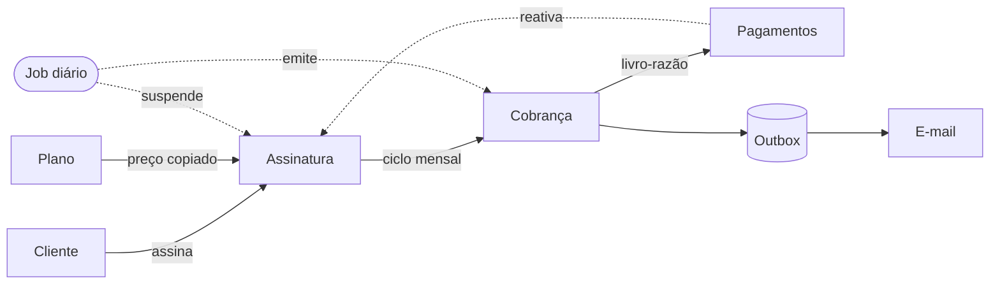
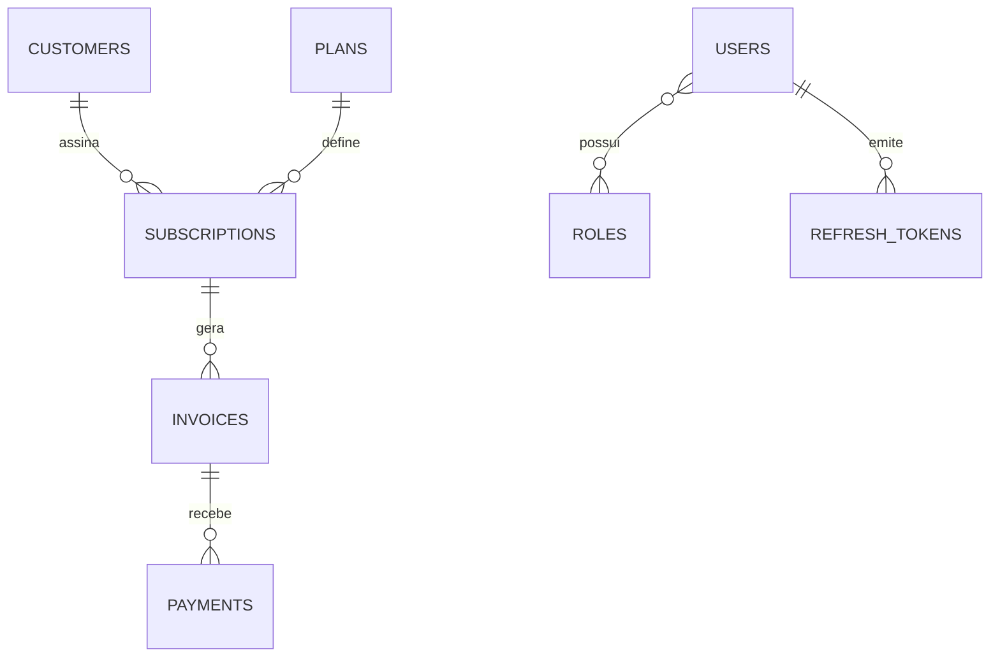
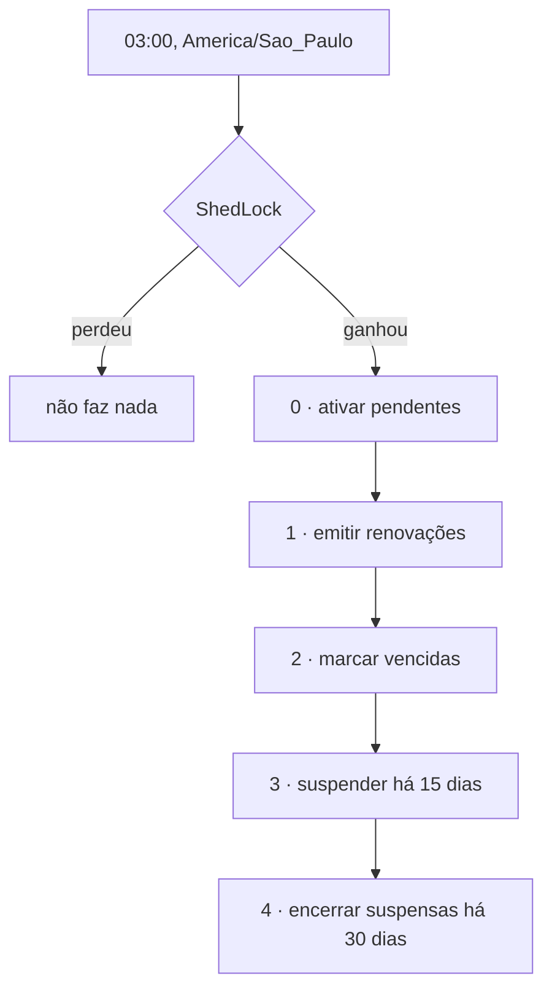

# Billing Platform

> [!abstract] O que é
> API REST de **assinaturas recorrentes e cobrança**: uma empresa vende planos,
> clientes assinam, o sistema emite faturas mensais automaticamente, registra
> pagamentos, cobra inadimplentes e reporta o financeiro.
>
> Primeiro projeto **Java** do workspace — os outros seis são Node.



---

## Estado

- [x] **Fase 1** — Fundação, schema completo, erro global RFC 7807
- [x] **Fase 2** — `Customer` (CRUD, paginação, filtros, ordenação)
- [x] **Fase 3** — `Plan` (catálogo, reajuste)
- [x] **Fase 4** — `Subscription` (máquina de estados, ciclo, vaga única)
- [x] **Fase 5** — `Invoice` (emissão idempotente)
- [x] **Fase 6** — `Payment` (livro-razão imutável, status derivado)
- [x] **Fase 7** — Segurança (JWT, refresh com rotação, 3 papéis)
- [x] **Fase 8** — Scheduler (ShedLock, 5 passos do ciclo)
- [x] **Fase 9** — Dashboard financeiro
- [x] **Fase 10** — Outbox + Spring Mail

**187 testes verdes** — 104 unitários (~15 s, sem Docker) e 83 de integração
contra Postgres real. Cobertura **89,2%**, com gate de 80% no build.

> [!success] Publicado
> https://github.com/CaioCodes1/billing-platform — público, 25/08/2026

> [!danger] O que a auditoria de segurança encontrou
> 12 testes que **atacam** a API (token forjado, `alg: none`, payload trocado,
> escalada de papel) + Semgrep em container: **153 regras, 105 arquivos, 0
> achados**. Mas dois testes só passaram depois de expor problema real:
>
> - **`httpBasic` ligado numa API que só fala JWT.** Não abria porta — mas só
>   porque o `JwtDecoder` faz a auto-configuração do usuário padrão recuar.
>   Proteção por efeito colateral de outra biblioteca, não por decisão.
>   Removido.
> - **O e-mail derrubava o health check.** `MailHealthIndicator` abre SMTP a
>   cada `/actuator/health`. Mailpit fora → 503 → em produção o orquestrador
>   tiraria a API de rotação, derrubando cobrança e pagamento por causa de um
>   canal de notificação. Health responde *"consigo atender requisições?"*, não
>   *"está tudo perfeito?"*.
>
> Lição de método: o primeiro teste do Basic Auth era **fraco** — mandava
> credencial errada e conferia o 401, que acontece nos dois mundos. O que
> distingue é o header `WWW-Authenticate` na resposta. Teste de segurança que
> passa pelo motivo errado é pior que teste nenhum.
>
> 📄 Nota completa: [[Auditoria de Segurança]]

> [!warning] Pendência que sobrou no workspace
> `bank-api` continua sem git, sem README e sem `CLAUDE.md` — é agora o único
> projeto nessa situação, o risco que este aqui tinha até hoje.

---

## As decisões que definem o sistema

Estas são as que separam um CRUD de um sistema de cobrança. Todas estão
justificadas em `docs/ARQUITETURA.md`; aqui está a versão curta.

### 1. A cobrança nasce do ciclo, não do pagamento

> [!danger] Correção do enunciado original
> O enunciado dizia *"nova cobrança gerada após pagamento"*. Implementado assim,
> **quem não paga nunca recebe a segunda fatura** — o inadimplente fica devendo
> eternamente um mês, o "total pendente" do dashboard passa a ser
> estruturalmente errado e a régua de cobrança perde o insumo.

O job diário emite de quem tem renovação chegando, pago ou não. Duas regras
impedem a bola de neve:

- assinatura `SUSPENDED` **não gera** cobrança — a dívida para quando o serviço para
- quitada a pendência, volta a `ACTIVE` e o ciclo retoma

### 2. Snapshot vs. referência

```java
this.unitPrice = plan.getMonthlyPrice();   // cópia, não referência
```

Uma linha decide a arquitetura. Se o faturamento lesse `plans.monthly_price`,
um reajuste **reprecificaria a base inteira retroativamente**.

> [!tip] A pergunta que generaliza
> **Esse valor descreve o mundo agora, ou registra um acordo do passado?**
> Preço de catálogo descreve agora. Preço contratado registra um acordo.
> Coisas do segundo tipo se **copiam**.
>
> Vale igual para: endereço de entrega num pedido, nome do produto numa nota
> fiscal, alíquota de imposto numa venda.

São **duas cópias em série**: plano → assinatura → cobrança. Cada uma protege
a anterior. A contrapartida é o endpoint explícito `POST /subscriptions/{id}/migrate-price`.

### 3. As garantias críticas moram no banco

Três regras **não** são `if` no service:

| Garantia | Mecanismo |
|---|---|
| Um cliente, uma assinatura | índice único **parcial** — só `CANCELLED` libera a vaga |
| Uma cobrança por competência | `UNIQUE (subscription_id, period_start)` |
| Pagamento imutável | trigger recusa `UPDATE` e `DELETE` |

> [!important] Por que `if` não basta
> ```
> Requisição A: já existe? → não
> Requisição B: já existe? → não
> A: INSERT ✓
> B: INSERT ✓   ← duas assinaturas
> ```
> As duas leram antes de qualquer uma escrever. O `if` **não é uma trava** —
> é a leitura de um estado que já mudou quando você age sobre ele.
>
> O `if` continua no código, mas **pela mensagem**, não pela garantia: ele diz
> "já existe um plano chamado Premium"; a constraint diz "conflita com registro
> existente". O primeiro é útil, o segundo é correto. Queremos os dois.

### 4. O status da cobrança é derivado, nunca atribuído

Nenhum caminho faz `invoice.setStatus(PAID)` olhando um pagamento isolado.
Soma-se o razão inteiro e compara-se com o valor devido.

De graça, sem um `if` por cenário:
- pagamento parcial → soma < valor
- pagamento a maior → crédito visível, não perdido
- estorno PIX / chargeback → um lançamento `REFUND`
- auditoria financeira completa, sem tabela de auditoria

### 5. O bug do dia 31

```
31/01 .plusMonths(1) → 28/02   ✓ correto
28/02 .plusMonths(1) → 28/03   ✗ virou "cliente do dia 28" para sempre
```

> [!bug] O erro sutil
> O `plusMonths` está **certo**. O erro é usar a data *já limitada* como base do
> próximo cálculo — a limitação de fevereiro vira permanente.

Solução: guardar `billing_day` (1–31) separado de `current_period_start` e
recalcular sempre a partir dele. Ver `BillingCycle` — funções **puras**,
testáveis sem Spring, sem banco e sem relógio.

### 6. Outbox: o e-mail que não pode ser desfeito

Mandar e-mail dentro de `@Transactional` tem dois defeitos:
1. SMTP lento segura a conexão do banco
2. rollback depois do envio = cliente recebeu aviso de algo que não existe

O evento é gravado **na mesma transação** do dado. Um worker separado despacha,
com retry e backoff exponencial.

```sql
SELECT * FROM outbox_messages
WHERE status = 'PENDING' AND next_attempt_at <= now()
ORDER BY next_attempt_at LIMIT 50
FOR UPDATE SKIP LOCKED   -- ← várias réplicas, conjuntos disjuntos, sem coordenação
```

---

## Modelo de dados



Mais `outbox_messages` (fila de eventos) e `shedlock` (eleição do job).

**Convenções:**
- `VARCHAR` + `CHECK` para enums, não `ENUM` nativo do Postgres
- `NUMERIC(19,4)` para dinheiro; `BigDecimal` no Java, **nunca** `double`
- 4 casas decimais, não 2 — cálculo proporcional precisa de casas intermediárias
- `DATE` para vencimento/competência (sem fuso); `TIMESTAMPTZ` para carimbos
- `UUID` como chave: não expõe contagem de clientes na URL

---

## O ciclo de faturamento



Prazos em `application.yml` — são decisão comercial, não podem exigir recompilar.

> [!note] Por que ShedLock
> `@Scheduled` dispara em **toda** instância. Com duas réplicas o faturamento
> roda duas vezes. O índice único já impede a cobrança dupla, mas o trabalho
> seria feito em dobro. O ShedLock usa a própria tabela `shedlock` como árbitro
> — sem Redis, sem ZooKeeper.
>
> Já o **worker do outbox NÃO usa ShedLock**, de propósito: despacho de e-mail
> se beneficia de paralelismo, e o `SKIP LOCKED` já evita duplicidade.

> [!warning] A pegadinha do `@Transactional` — caí nela mesmo tendo documentado
> O `@Transactional` funciona **por proxy**: só tem efeito quando a chamada
> entra no bean **de fora**. `this.metodoTransacional()` não abre transação —
> silenciosamente. Por isso `BillingItemProcessor` é um bean separado do
> `BillingRunner`.
>
> Extraí o processador justamente por causa disso… e depois escrevi
> `executarCicloDiario()` chamando `this.suspenderInadimplentes(...)`, que era
> `@Transactional`. Passou despercebido até o teste de integração:
>
> ```
> IllegalTransactionStateException: No existing transaction found
> for transaction marked with propagation 'mandatory'
> ```
>
> Quem denunciou foi o `OutboxPublisher`, que declara
> `Propagation.MANDATORY` — ele **exige** transação existente. Sem essa
> anotação defensiva, o evento simplesmente não teria sido gravado e ninguém
> descobriria até faltar um e-mail em produção.
>
> **Lição dupla:** conhecer a armadilha não basta, e `MANDATORY` em quem
> depende de transação transforma um bug silencioso em erro alto.

---

## Segurança

| | ADMIN | FINANCIAL | SUPPORT |
|---|:---:|:---:|:---:|
| Planos (escrita) | ✅ | ❌ | ❌ |
| Usuários | ✅ | ❌ | ❌ |
| Clientes (escrita) | ✅ | ❌ | ✅ |
| Assinaturas (escrita) | ✅ | ✅ | ❌ |
| Pagamentos / estornos | ✅ | ✅ | ❌ |
| Dashboard | ✅ | ✅ | ❌ |

- **Access token** JWT, 15 min, stateless — curto porque não dá para revogar
- **Refresh token** opaco, guardado como **hash SHA-256** — vazamento do dump não vira sessão
- **Rotação com detecção de reuso**: token já rotacionado reapresentado → revoga a **família inteira**
- `@PreAuthorize` no **service**, não no controller — a regra vale mesmo se a rota mudar
- Nenhum usuário em migration; admin inicial vem de variável de ambiente

---

## Ambiente e armadilhas

> [!danger] Testcontainers × Docker Engine 29 — obrigatório
> O docker-java do Testcontainers 1.21.2 negocia **API 1.32**; o Engine 29.7.2
> exige **mínimo 1.40**. Sem os dois ajustes, nenhum teste de integração roda.
>
> | Onde | Valor |
> |---|---|
> | `~/.docker-java.properties` | `api.version=1.44` |
> | variável `DOCKER_HOST` | `npipe:////./pipe/docker_engine_linux` |
>
> **Por que o `DOCKER_HOST`:** os pipes padrão passam por um proxy do Docker
> Desktop que responde **400 com um `Info` vazio**, escondendo a causa real.
> O `docker_engine_linux` é o engine cru e devolve `client version 1.32 is too old`.
>
> ⚠️ `docker run hello-world` funcionar **não prova** que o Testcontainers vai
> funcionar — o CLI negocia 1.55.

> [!bug] Distro do Docker parando sozinha
> Sintoma: `docker info` **pendura** em vez de falhar; `wsl --list` mostra
> `docker-desktop Stopped` com a VM (`vmmemWSL`) ainda viva.
>
> Correção rápida (~5 s):
> ```bash
> wsl -d docker-desktop --exec /bin/true
> ```
> Reiniciar o Docker Desktop inteiro leva ~5 min. Manter containers rodando
> (`docker compose up -d`) evita a ociosidade que dispara o problema.

> [!bug] Sockets órfãos travando o backend
> `sailor-ingest.sock` em `%LOCALAPPDATA%\Docker\run`. Procedimento:
> 1. matar `Docker Desktop` **e** `com.docker.backend`
> 2. **renomear** (não apagar) `Docker\run` e `docker-secrets-engine` de uma vez
> 3. só então iniciar
>
> O diálogo oferece *Reset to factory defaults* — **não é necessário** e
> apagaria imagens e volumes.

> [!failure] Erro meu que vale registrar
> Diagnostiquei "a VM do WSL desliga por ociosidade" e apliquei
> `vmIdleTimeout=-1` no `.wslconfig`. **Não era isso** — a VM estava viva, quem
> parava era a distro. Mirei no alvo errado e o comentário do arquivo foi
> corrigido para dizer isso.

### Toolchain

| | Onde | Nota |
|---|---|---|
| JDK 21 | `C:\Program Files\Microsoft\jdk-21...` | `winget install Microsoft.OpenJDK.21` |
| Maven 3.9.16 | `D:\dev-tools\` | **Não existe no winget** — CDN da Apache, SHA-512 conferido |
| `.m2` | `D:\dev-cache\m2` | cresce para GB; o `C:` tem ~14 GB |

---

## Os quatro bugs que só o teste de integração pegou

Nenhum destes aparecia em teste unitário — todos passavam. É o argumento mais
concreto a favor de testar contra banco e contexto reais.

> [!danger] 1. O job trabalhava com entidades *detached* e não gravava nada
> O runner carregava as assinaturas numa consulta que abria e fechava a própria
> transação, e passava o **objeto** ao processador. Dentro do método
> transacional, `assinatura.advanceCycle()` alterava a memória e nada mais:
> nenhum `UPDATE` era emitido.
>
> O job rodava, logava "assinatura ativada", devolvia contadores positivos — e o
> banco não mudava. **Correção:** passar o *id* e recarregar dentro da
> transação, o que devolve entidade gerenciada e liga o dirty checking.

> [!danger] 2. O `@PreAuthorize` quebrou o scheduler
> A fase 7 pôs `isAuthenticated()` no `InvoiceService`. A fase 8 chama esse
> service pelo job — que roda **sem requisição HTTP e sem usuário**. Resultado:
> `AuthenticationCredentialsNotFoundException` às 3 da manhã.
>
> O teste unitário não pegou porque instancia o service com `new`, o que não
> passa pelo proxy do Spring.

> [!danger] 3. A revogação da família era desfeita pelo próprio 401
> ```java
> revogarFamilia(...);                    // revoga
> throw new UnauthorizedException(...);   // RuntimeException → rollback
> ```
> O atacante recebia 401 e **parecia** que a defesa funcionou — mas os outros
> tokens da família continuavam válidos, que é exatamente o que ela existia para
> impedir. Só um teste que tenta usar o *outro* token revela.
>
> **Regra:** efeito colateral que precisa sobreviver a uma exceção exige
> transação própria (`Propagation.REQUIRES_NEW`).

> [!danger] 4. Não dava para fazer logout
> `/auth/logout` não estava nas rotas públicas. Exigir access token válido para
> encerrar sessão é circular: quem tem o access expirado não consegue nem sair.

> [!info] E dois que eram dos testes, não do código
> - `closeTo(0.0)` falha porque JSON `0` chega como `Integer` e o matcher do
>   Hamcrest só aceita `Double`
> - testes sem `@Transactional` **commitam**: sem limpar depois, os CPFs fixos
>   colidem com o índice único e os vizinhos falham por motivo alheio

---

## Lições de Spring/JPA colhidas no caminho

> [!tip] `ddl-auto: validate`, nunca `update`
> Uma divergência entre entidade e schema **derrubou o boot** — que é a feature.
> Com `update`, o Hibernate teria alterado a tabela sozinho, em silêncio, e o
> schema real divergiria das migrations até estourar em produção.

> [!tip] `CHAR(n)` no Postgres é armadilha
> Preenche com espaços à direita. Não é mais rápido que `varchar`, só mais
> traiçoeiro. A própria documentação desaconselha.

> [!tip] `open-in-view: false`
> Ligado (padrão do Boot!), a sessão do Hibernate fica aberta até a resposta ser
> serializada — esconde N+1 atrás da renderização do JSON e segura conexão do pool.

> [!tip] `@EntityGraph` para o N+1
> Listar 20 assinaturas com cliente e plano LAZY = **41 queries**. Com o grafo,
> uma. Só vale para `...ToOne` — com coleção, `join fetch` + paginação faz o
> Hibernate paginar **em memória**.

> [!tip] `equals`/`hashCode` na mão, não `@Data`
> O `@Data` do Lombok gera `equals` sobre todos os campos: toca associações lazy
> e muda o `hashCode` quando um campo muda, corrompendo entidades dentro de um
> `HashSet`.

> [!tip] Cobertura sobre código com lógica
> DTO, mapper gerado, entity e config **excluídos** do JaCoCo. Contá-los infla o
> número sem um teste a mais — a métrica vira teatro.

> [!tip] JaCoCo + Failsafe
> A receita que circula (`<argLine>${failsafeArgLine}</argLine>`) aponta para uma
> propriedade que o JaCoCo **não define**. O agente não anexa e a cobertura de
> integração aparece como **zero, sem nenhum erro no build**.

> [!tip] Violar constraint aborta a transação no Postgres
> Não dá para capturar a exceção e continuar trabalhando na mesma transação.
> Por isso a emissão **consulta antes de inserir**, em vez de tentar e capturar.

---

## Comandos

```bash
cd E:/projetos/billing-platform

docker compose up -d      # Postgres 5433, Mailpit 8025
mvn spring-boot:run       # API 8080, Swagger em /docs
mvn test                  # 98 unitários, ~15s, SEM Docker
mvn verify                # + integração (Testcontainers)
```

| Endereço | O quê |
|---|---|
| http://localhost:8080/docs | Swagger UI |
| http://localhost:8025 | Mailpit — e-mails enviados |
| http://localhost:8080/actuator/health | Health |

---

## Links

- `docs/ARQUITETURA.md` — as decisões com trade-offs explícitos
- `CLAUDE.md` — índice do projeto e armadilhas de ambiente
- [[bank-api]] — o projeto anterior, com schema ambicioso e só o módulo `health`
- [[helpdesk-api]] — maior em linhas, menor em complexidade
